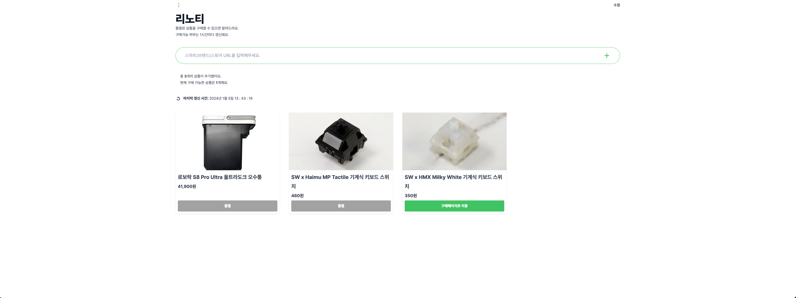
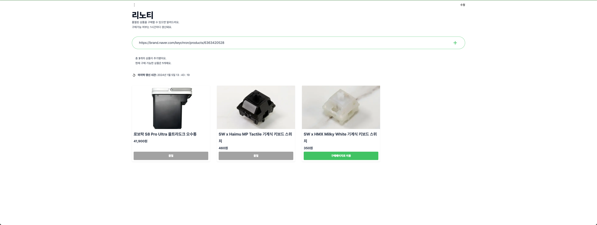
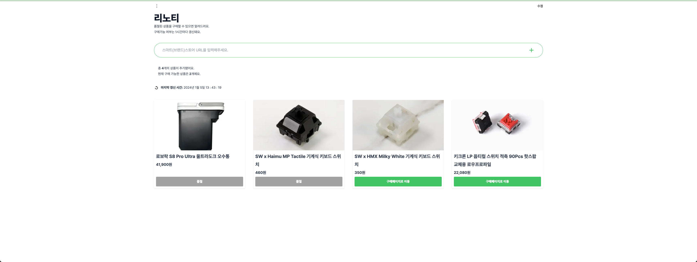
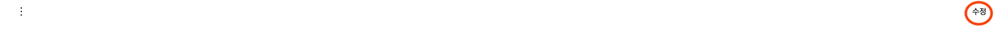
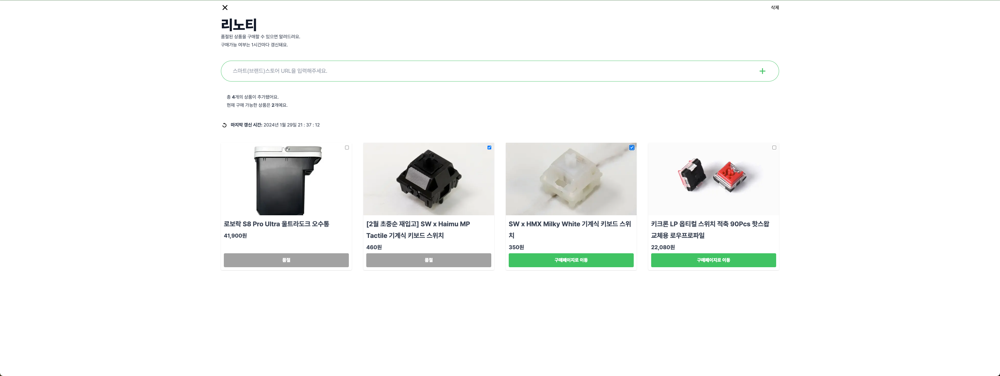
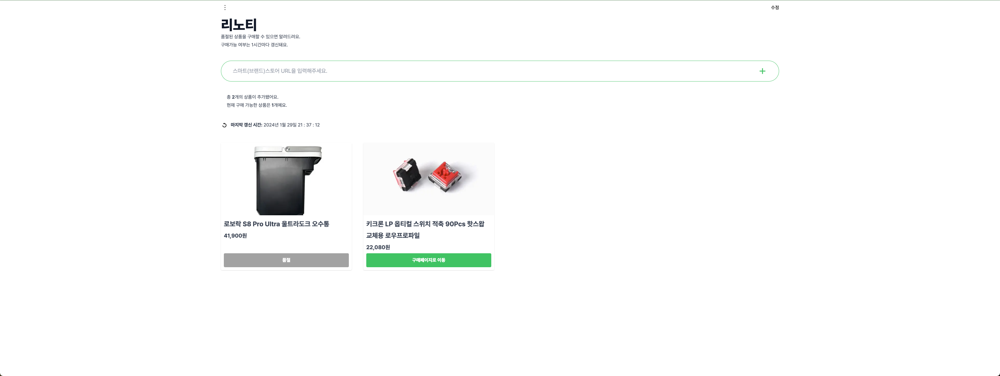

# 리노티

해당 프로젝트는 개발중지 되었습니다.   
조금 굴려보니 네이버 스마트스토어에서 차단돼서 중단하게 되었습니다.   

네이버 스마트스토어 상품의 재입고 여부를 확인하는 서비스입니다.  
상품은 자동으로 갱신되며 재입고되어 상품을 구매할 수 있을 때 알려드려요.

## 사용방법

### 상품 추가

1. 사이트 중간의 URL 입력창에 추가하고 싶른 상품의 스마트스토어 URL을 입력해주세요.
   
2. 등록이 되었다면 재입고 될 때 까지 기다리새요.
   
3. 재입고 되었다면 상품을 확인해보세요!
   

### 상품 삭제

1. 페이지 상단의 수정 버튼을 눌러주세요.
   
2. 삭제할 상품을 골라주세요
   
3. 선택 후 삭제 버튼을 눌러 상품을 삭제하세요.
   
